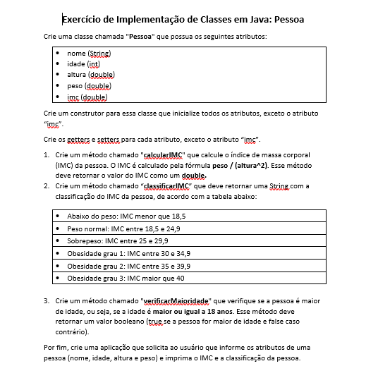

# **🚀 Enunciado da questão Pesssoa*

# **📝 Classe Pessoa**
[Clique aqui para ir para Classe Retângulo](Pessoa.java)

# **💻 Aplicação Pessoa**
[Clique aqui para ir para Aplicação Retângulo](AppPessoa.java)

