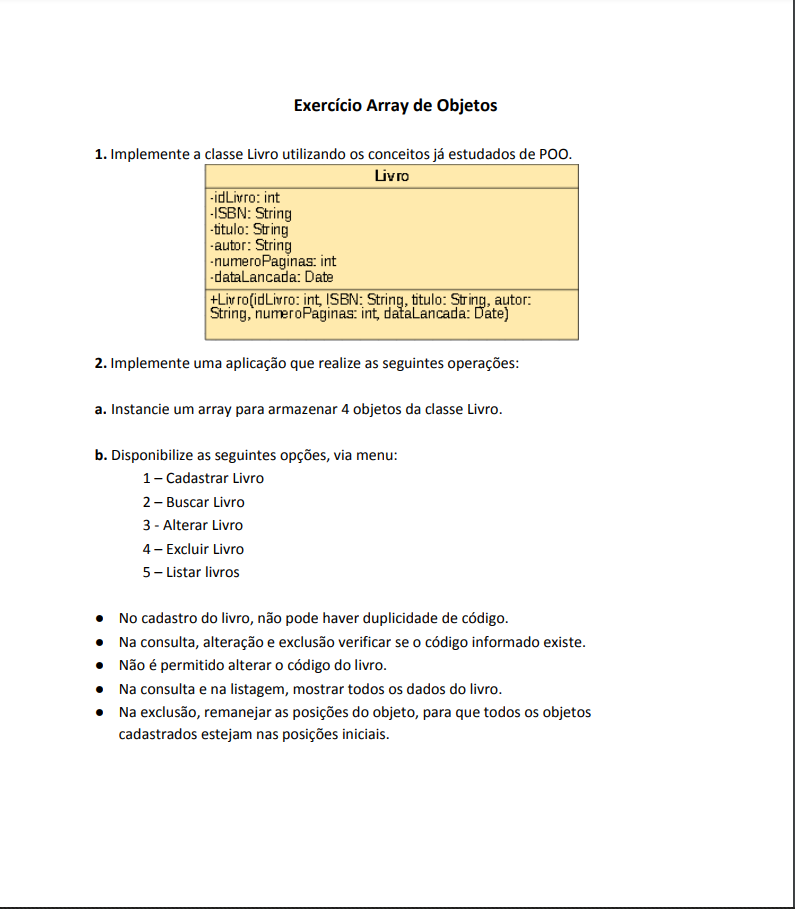

# **🚀 Enunciado da questão Livro - Array de Objetos**

# **📝 Classe Livro**
[Clique aqui para ir para Classe Livro](Livro.java)

# **💻 Aplicação Array de Objetos Livro**
[Clique aqui para ir para Aplicação Array de objetos da classe Livro](AppArrayLivros.java)

